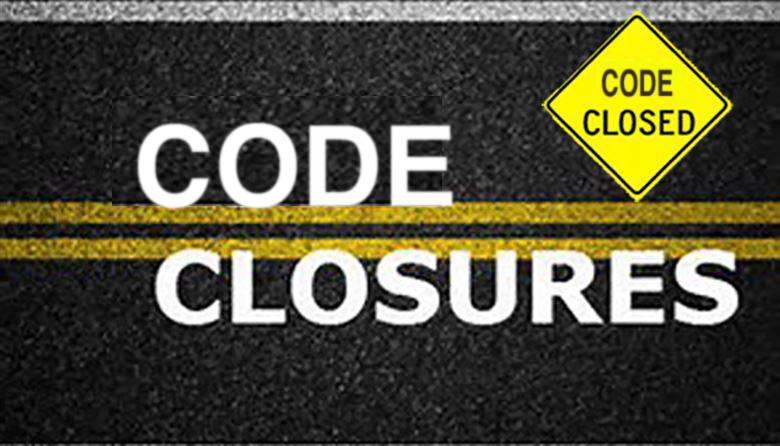
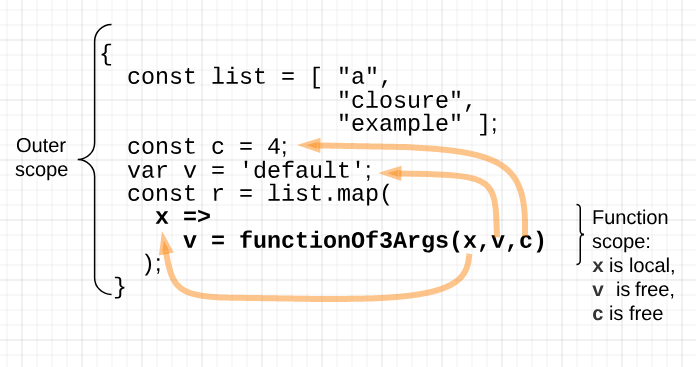
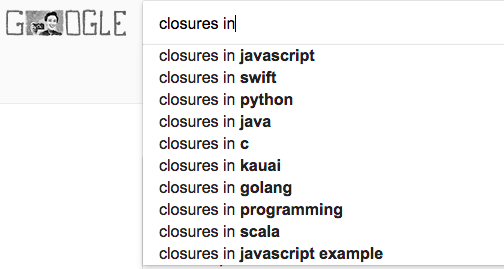
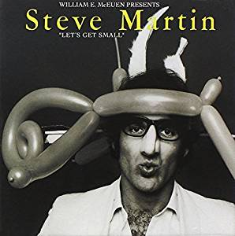
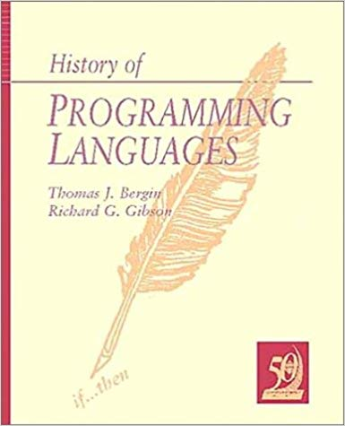
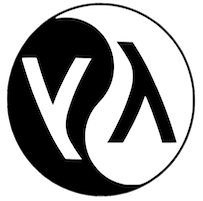

## Everything New
## is Old Again

A Brief History of Time <br/>
(with Javascript Closures) 

Wilmington JS - Aug 21, 2018

David Biesack<br/>
VP, API Platforms &amp; Lead API Architect, [APITURE](http://www.apiture.com)

========



--------

# Closures are _core_ to JavaScript ...
# ... and Node.js <!-- .element: class="fragment" -->
# ... and functional programming <!-- .element: class="fragment" -->

--------

# Closures Explained

A function whose _free_ variables  (or _open_ bindings ) have been _closed_
(or _bound_) in its containing lexical environment, resulting in a
_closed_ expression (one with no free variables):

<code>
<pre>
  const list = ["a", "closure", "example"];
  var v = 'default';
  const c = 4;
  const r = list.map(<span style='color:yellow'>x => v = functionOf3Args(x,v,c)</span>);
</code>
</pre>

--------

# Outer vs. function lexical scope



--------

# Necessity is the Mother of Invention

### Nobody mentions Invention's father... <!-- .element: class="fragment" -->
### Conclusion: Javascript Closures are Necessity's Bastard? <!-- .element: class="fragment" -->

========

# The Neccessity Defense

<code>
<pre>
&lt;body onload=&quot;<span style='color:yellow'>document.write('&lt;h1&gt;Everthing New&lt;/h1&gt;'</span>
                           <span style='color:yellow'>+ '&lt;p&gt;is Old Again&lt;/p&gt;')</span>&quot;&gt;
</pre>
</code>

The `onload` right hand side is a Javascript function body.

`document` is a _free_ variable 
within that function body.
`document` is _bound_ outside of
the function, but available in
the function's *environment*.

--------

## The Neccessity Defense, Part II

`Array.prototype.forEach(callback)` requires a callback function :

  * `callback(item)`
  * `callback(item, index, array)`

--------

But what if you want to call a function
that requires _three_ arguments?

... or mutate or collect state on each call?

## Closures to the rescue! <!-- .element: class="fragment" -->

--------

[reveal.js](https://revealjs.com/#/)

<code>
<pre>
function getStatusText( node ) {
   var text = '';
   var isAriaHidden = node.getAttribute( 'aria-hidden' );
   var isDisplayHidden = 
       window.getComputedStyle( node )['display'] === 'none';
   if ( isAriaHidden !== 'true' && !isDisplayHidden ) {
     toArray( node.childNodes ).forEach(
               <span style='color:yellow'>function( child ) {
                 text += getStatusText( child );
               }</span>
             );
   }
   return text;
</pre>
</code>

<span class="fragment">`child` is _bound_ in the anonymous function</span>

<span class="fragment">`text` is _free_ in the anonymous function</span>

<span class="fragment">`text` is _closed_ in the environment</span>

--------

# ... But JS is far from the _first_ 

========

# History

## Everything New... is Old Again

--------



--------

## First, Some Historical Context

 <!-- .element: class="fragment" -->

--------

## ~~First, Some Hysterical Context~~
## First, Some  Historical  Context



--------

"Closure" coined by Peter J. Landin in  1964 

========

## A Very Brief History of Our Time With Closures

_Lisp was created in the late 1950's by John McCarthy and others at_
_M.I.T. One feature of the language was function-valued expressions,_
_signified by lambda. The name  lambda  was borrowed from a mathematical_
_formalism known as the lambda calculus. [...]_

--------

_Although Lisp was not based on an effort to model that formalism,_
_lambda plays approximately the same role in Lisp as it does in the_
_lambda calculus: lambda is the syntax for a function-valued_
_expression. [...]_

### `(lambda (x) x)`

Look familiar?

--------

_Now we fast-forward to the mid 1970's. [...]_
_A number of popular Lisp dialects were in use including InterLisp,_
_MacLisp, UCI-Lisp, Stanford Lisp 1.6, and U. Utah's Standard Lisp. All_
_of them were dynamically scoped._

**_It was in this context that Guy Steele and Gerald Jay Sussman developed Scheme, a very simple Lisp dialect._**

Neil Gafter, [_A Definition of Closures_](http://gafter.blogspot.com/2007/01/definition-of-closures.html)

========

# Scheme

First languages to adopt closures, 1975

_Revised<sup>3</sup> Report on the Algorithmic Language Scheme_

### `(YF) = (F (YF))`

<small>`(define (y f) (lambda () (funcall f (y f))))`</small>

--------

# Scheme

<code>
<pre>
(define (functionOf3Args x v c)
  (if (> (string-length x) c)
      x
      v))

(let ( (l '("a" "closure" "example"))
       (v "value")
       (c 4)
      )
   (map <span style='color:yellow'>(lambda (x) (write-line (functionOf3Args x v c)))</span> l)
)
</pre>
</code>

yields:

```
"value"
"closure"
"example"
```

========

# Lisp

"Lisp was originally created as a practical mathematical notation for
computer programs, influenced by the notation of Alonzo Church's lambda
calculus." - Wikipedia



--------

# Lisp

Common LISP: Newer variant of LISP, with lexical (not dynamic) scoping,
closures (Guy Steele, again)

<code>
<pre>
(defun functionOf3Args (x v c)
  (if (> (string-length x) c)
      x
      v))

(let ( (l '("a" "closure" "example"))
       (v "value")
       (c 4)
      )
   (map <span style='color:yellow'>(lambda (x) (write-line (functionOf3Args x v c)))</span> l)
)
</pre>
</code>

========

# Lambda Calculus

_The granddaddy of them all!_

Alonzo Church formalized the mathematics of functions
and variable binding with the Lambda Calculus in the 1930's

_"The smallest universal programming language"_

[_A Tutorial Introduction to the Lambda Calculus_](https://www.inf.fu-berlin.de/lehre/WS03/alpi/lambda.pdf), Ra&uacute;l Rojas

--------

_The &lambda; calculus consists of a single transformation rule (variable substitution)
and a single function definition scheme. It was introduced in the 1930s by Alonzo
Church as a way of formalizing the concept of effective computability._ -- Rojas

The &lambda; calculus helps us understand and model computation, primarily through
pure functions.

--------

<code>
<pre> 
 &lt;expression&gt; := &lt;name&gt; | &lt;function&gt; | &lt;application&gt;
   &lt;function&gt; := &lambda; &lt;name&gt;.&lt;expression&gt;
&lt;application&gt; := &lt;expression&gt;&lt;expression&gt;
</pre>
</code>

### <code>&lambda;x.x</code>

is a _function_

### <code>(&lambda;x.x)y</code>

is an _application_ of a function to an _argument_

## <code>(&lambda;x.x)y = [y/x]x = y</code>

--------

From these roots, a functional model of numbers and even arithmetic
and logic functions can be defined in a purely function-based model

  * `0` is modeled as a function
  * `1` is modeled as `S0`, the application of a _successor_ function `S` to `0`
  * `2` is modeled as `SS0`, the application of a _successor_ function to `1`
  * ... boolean values true and false, logical operations like less than, greater than
  * ... and recursion

[_A Tutorial Introduction to the Lambda Calculus_](lambda/lambda.pdf), Ra&uacute;l Rojas

========

# Historical Context

<span class="fragment">Church's lambda calculus was _10 years before stored-program computers were invented_. </span>

<span class="fragment">Church's lambda calculus was _20 years before programming languages were invented_. </span>

--------


Those who remember [the best of] the past of programming languages are _fortunate_ to repeat it.

